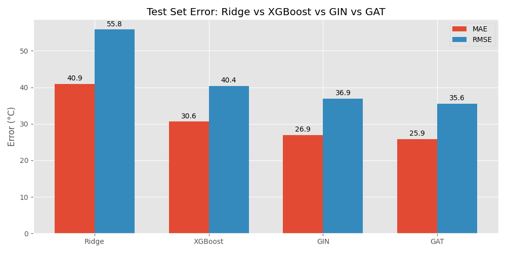
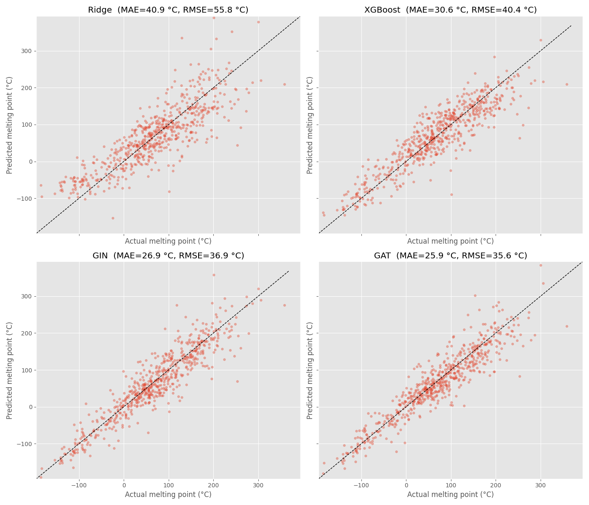
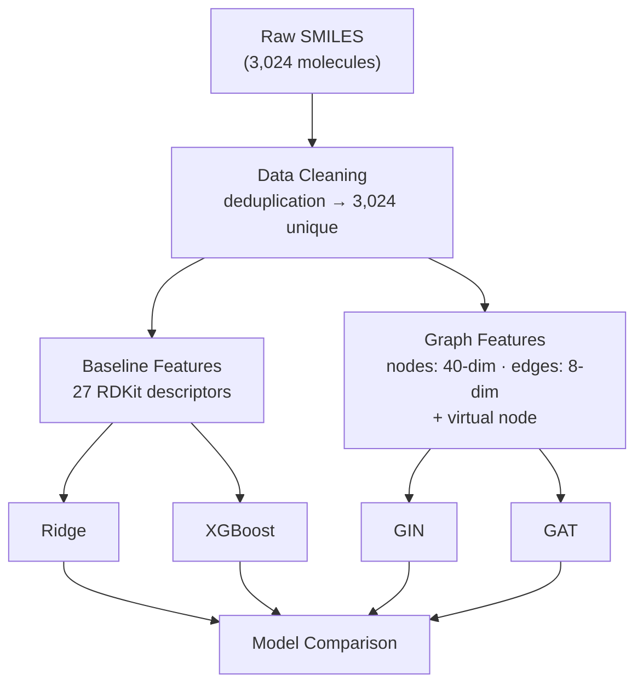
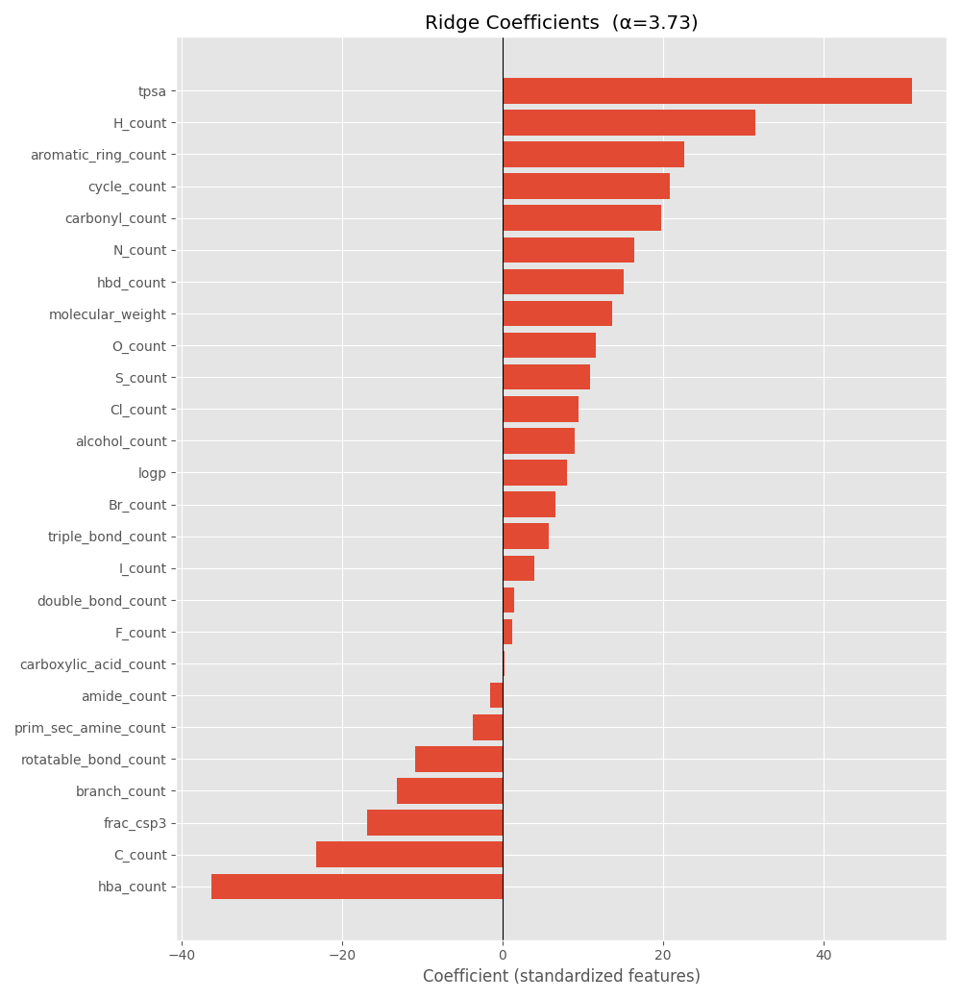
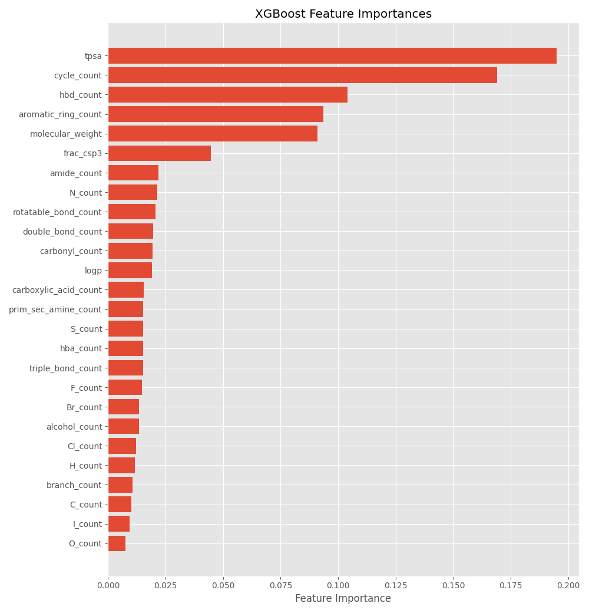
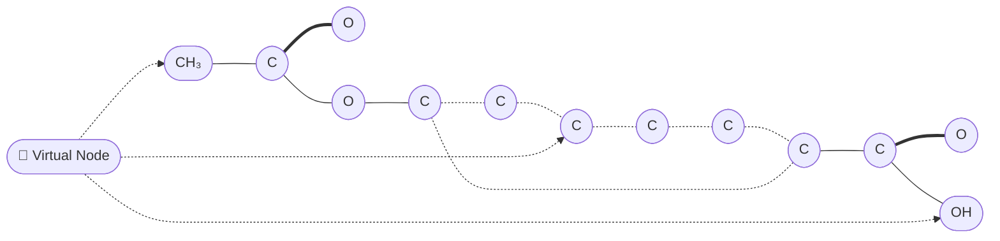
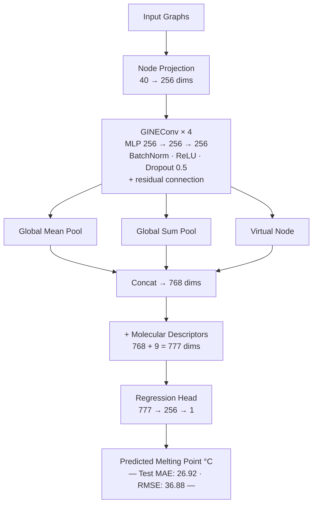

# GraphNet: Molecular Melting Point Prediction

> Predicting melting points from molecular structure using graph neural networks — and showing how far they outperform classical baselines.

---

## The Problem

A molecule's melting point is a fundamental physical property, yet predicting it from structure alone remains challenging. The [Bradley Double Plus Good Melting Point Dataset](https://figshare.com/articles/dataset/Bradley_melting_point_dataset/1031637) provides 3,024 curated molecules with measured melting points, giving us a clean benchmark.

The core question: **does explicitly representing a molecule as a graph — atoms as nodes, bonds as edges — yield better predictions than hand-crafted descriptors?**

The answer is a clear yes.

---

## Results at a Glance

| Model | MAE (°C) | RMSE (°C) | Approach |
|---|---|---|---|
| Ridge Regression | 40.94 | 55.80 | L2-regularized linear model on 27 RDKit descriptors |
| XGBoost | 30.64 | 40.40 | Gradient boosting on same descriptors |
| **GIN** | **26.92** | **36.88** | Graph Isomorphism Network with virtual node |
| **GAT** | **25.86** | **35.56** | Graph Attention Network with multi-head attention |

Graph neural networks cut MAE by **~37%** compared to the best classical baseline.





---

## Pipeline Overview



---

## Molecular Representation

### Baseline: Hand-Crafted Descriptors

27 molecular descriptors extracted with [RDKit](https://www.rdkit.org/):

```
Atom counts   │  C  H  O  N  S  F  Cl  Br  I
Structural    │  MolWt  LogP  TPSA  RotBonds  Rings  AromaticRings  fsp3
Functional    │  C=C  C≡C  COOH  OH  C=O  NH/NH₂  CONH
Pharmacophore │  HBD  HBA
```





### Graph Neural Networks: Atoms as Nodes, Bonds as Edges

Each molecule becomes a graph. A virtual "supernode" connects bidirectionally to every atom, enabling global information flow.

**Aspirin — C₉H₈O₄ · mp ≈ 135 °C**



| Line style | Meaning |
|---|---|
| `——` solid | single bond |
| `══` thick | double bond |
| `╌╌` dashed | aromatic bond |
| `╌→` dashed arrow | virtual node edge (connects to all atoms) |

**Node features** (40 dims per atom): atom type · degree · H count · formal charge · aromaticity · hybridization · Gasteiger partial charge

**Edge features** (8 dims per bond): bond type · conjugation · ring membership · |ΔElectronegativity|

---

## Model Architectures

### GIN — Graph Isomorphism Network



Parameters: 690,029

### GAT — Graph Attention Network


Parameters: 637,697

Attention heads let the model selectively weight neighbors — the bond to a halogen matters differently than one in an aromatic ring. GAT's attention mechanism produces the best results in this project with *fewer* parameters than GIN.

---

## Training Details

Both GNN models share the same training setup:

| Setting | Value |
|---|---|
| Loss | L1 (MAE) — robust to outliers |
| Optimizer | Adam, lr=1e-3, weight_decay=1e-5 |
| LR Schedule | ReduceLROnPlateau (patience=20, factor=0.5) |
| Early Stopping | patience=40 epochs |
| Batch Size | 64 |
| Random Seed | 97 |

**GIN** converged at epoch 336 (validation MAE 24.34°C), stopped at 376.  
**GAT** converged at epoch 131 (validation MAE 23.95°C), stopped at 171 — faster and better.

---

## Dataset

**Bradley Double Plus Good Melting Point Dataset**

| Split | Samples |
|---|---|
| Train | 2,116 (70%) |
| Validation | 299 (10%) |
| Test | 609 (20%) |

Melting points span roughly −100°C to 350°C. After deduplication (one ambiguous stereoisomer removed), the dataset contains 3,024 molecules in SMILES format.

---

## Observations

**1. Graph topology is information.** The explicit bond graph captures structural patterns — ring systems, conjugation, branching — that are hard to encode in scalar descriptors. The ~37% MAE reduction over XGBoost reflects this directly.

**2. Attention helps with chemistry.** GAT's selective attention likely learns that certain bonds (e.g., conjugated, ring-closing) are more informative for melting point than others. The slight edge over GIN is consistent and shows up on both MAE and RMSE.

**3. Virtual nodes work well.** Adding a global supernode connected to all atoms provides long-range information flow without complicating the architecture — a small trick with meaningful impact.

**4. All models struggle with outliers.** Rigid polycyclic aromatics (anthraquinones, fullerenes) and functional-group-dense molecules (isocyanates, polyfluorides) defeat all models. The chemistry community would call this the "crystal packing problem" — intermolecular forces in the solid state depend on 3D geometry not present in SMILES.

**5. Classical baselines are surprisingly competitive.** XGBoost on 27 features matches Ridge on RMSE. Much of the signal is in simple counts (molecular weight, LogP, rotatable bonds). The GNNs add the rest.

---

## Tech Stack

| Purpose | Library |
|---|---|
| Cheminformatics | [RDKit](https://www.rdkit.org/) |
| Data wrangling | [Polars](https://pola.rs/), Pandas |
| Baseline models | scikit-learn, XGBoost |
| Deep learning | PyTorch, [PyTorch Geometric](https://pyg.org/) |
| Visualization | Matplotlib |
| Notebooks | JupyterLab |

---

## Notebooks

| Notebook | Contents |
|---|---|
| `00_data_cleaning` | Deduplication, split creation |
| `01_feature_engineering` | 27 RDKit descriptors from SMILES |
| `02_ridge_model` | Ridge regression with α sweep |
| `03_boosting_model` | XGBoost with early stopping |
| `04_graph_features` | Atom/bond featurization, graph construction |
| `05_gin_model` | GIN architecture, training loop, evaluation |
| `06_gat_model` | GAT architecture, training loop, evaluation |
| `07_model_comparison` | Side-by-side evaluation across all four models |

---

## Setup

```bash
uv sync
jupyter lab
```

Requires Python ≥ 3.14. GPU recommended for GNN training but not required.
